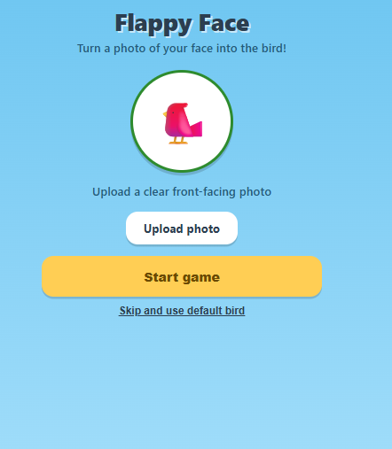
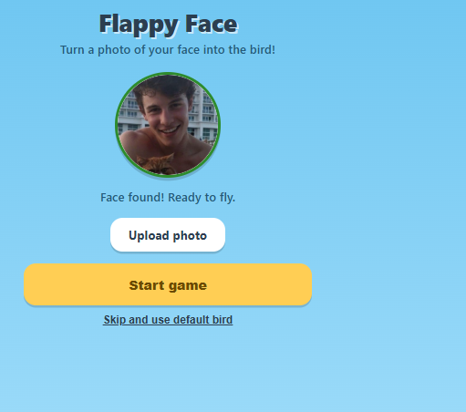
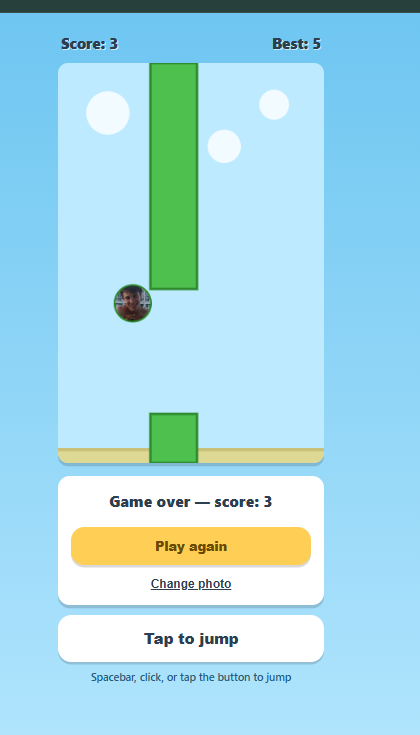
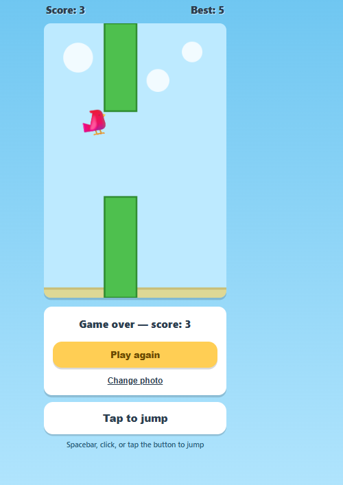

# Flappy Face 🐦

Everybody makes a plain Flappy Bird clone, so I wanted to add something extra
you upload a photo and it detects your face and turns it into the bird!
Wanted to prank someone with it, and it definitely made people smile 😄

## Screenshots

**Upload or use default bird**

**Uploaded face (added shawn mendes for obvious reasons)**

**Face as the bird**

**In-game**

## How it works

1. Upload a clear front-facing photo
2. face-api.js detects your face right in the browser (photo never leaves your device)
3. The face gets cropped into a circle and used as the bird
4. No face detected → falls back to a default bird emoji

## Controls

- Spacebar, mouse click, or the on-screen "Tap to jump" button

## Files

- `index.html`
- `style.css`
- `script.js`

## How to run

Open `index.html` in your browser. Needs internet the first time you upload
a photo since the face-detection model loads from a CDN.