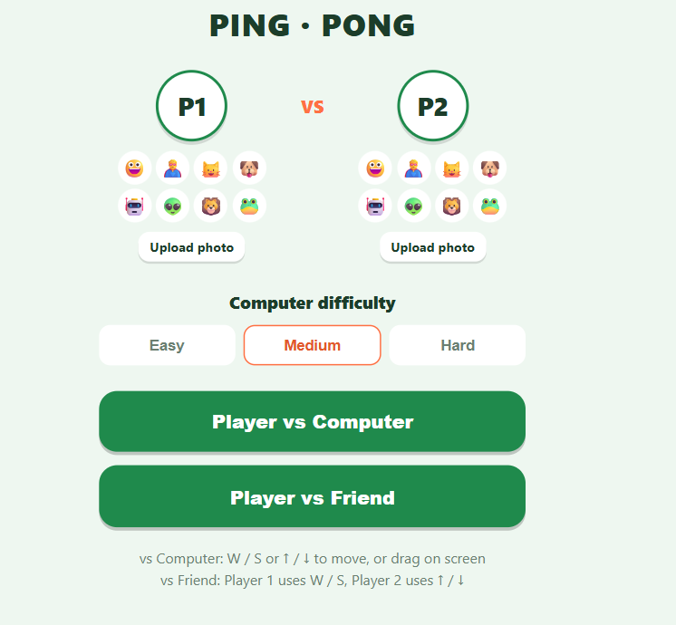
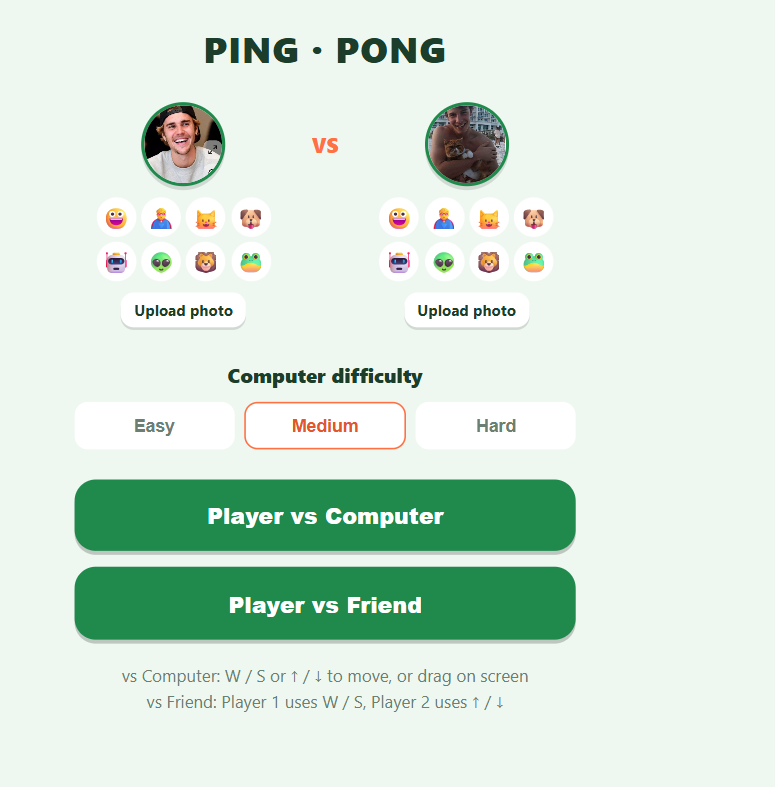
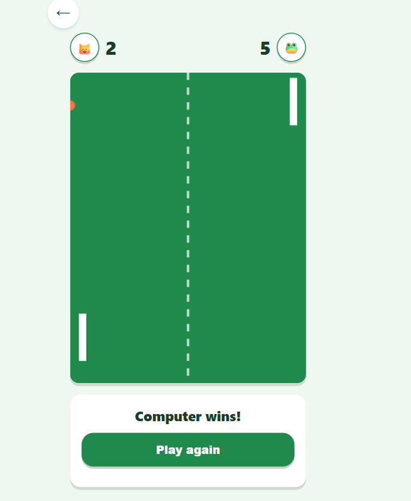
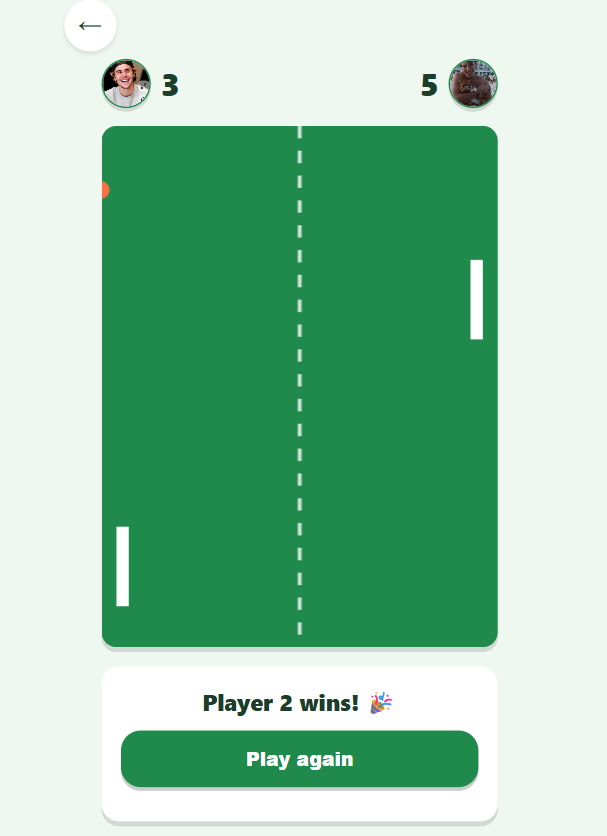

# Ping Pong 🏓

A classic Pong game, but I threw in avatars because plain paddles are boring.
Naturally, Shawn and Justin made another appearance here too 😄

## Demo
https://vishesharma20.github.io/Mini_Games/ping%20pong/

## Screenshots

**Landing page**

**Uploaded photo as avatar**

**vs Computer**

**vs Friend (Shawn won!)**

## Features

- vs Computer (easy / medium / hard) or vs Friend, split keyboard
- Pick a preset emoji avatar or upload your own photo for either player —
  shows up next to the score, Shawn-and-Justin style if you're into that
- Controls: W/S and Arrow keys, or just drag on the board on touchscreens

## Files

- `index.html`
- `style.css`
- `script.js`

## How to run

Open `index.html` in your browser.
