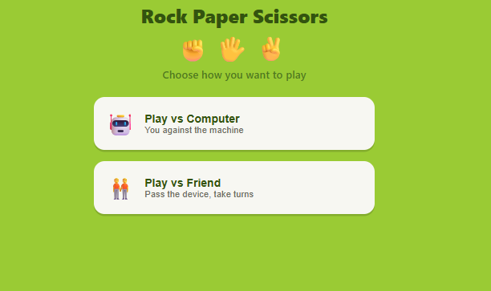
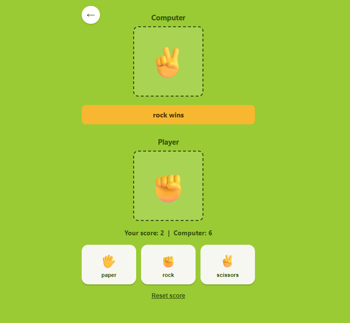
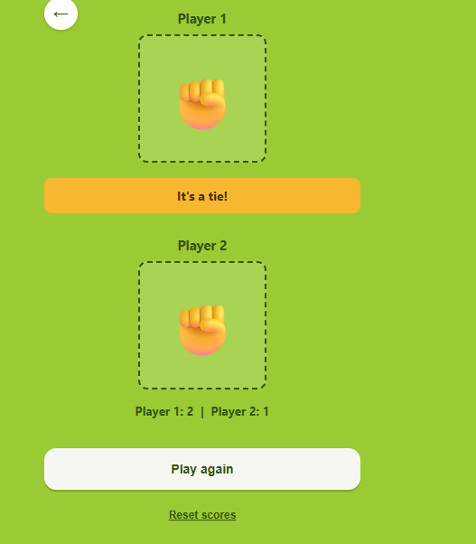
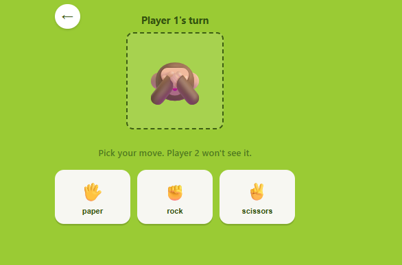
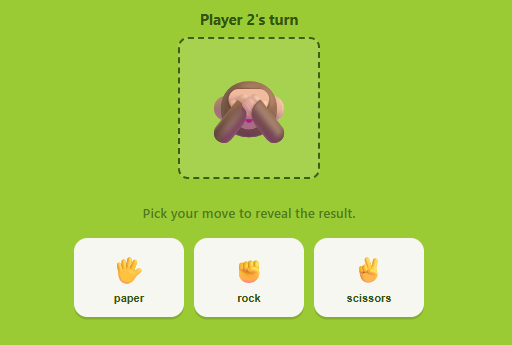

# Rock Paper Scissors

A simple Rock Paper Scissors game made with HTML, CSS, and JavaScript.

I got the inspo for this from a screenshot I found on Pinterest and decided to try
building it myself, it was a fun little project!

## Demo
https://vishesharma20.github.io/Mini_Games/rock,%20paper%20%26%20scissor/

## Modes

- **vs Computer** — play against a random computer pick
- **vs Friend** — pass the device, Player 1 picks first (hidden), then Player 2
  picks, then it reveals who won

## Screenshots

**Home screen**

**vs Computer**

**vs Friend — pass the device**

**vs Friend — Player 1 turn**

**vs Friend — Player 2 turn**

## Files

- `index.html`
- `style.css`
- `script.js`

## How to run

Just open `index.html` in your browser.

